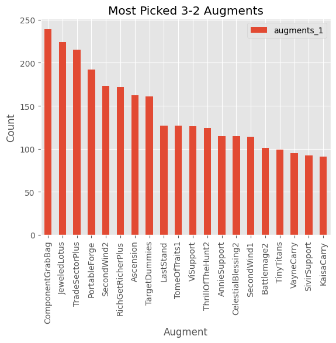
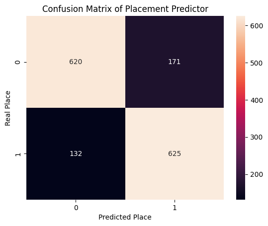
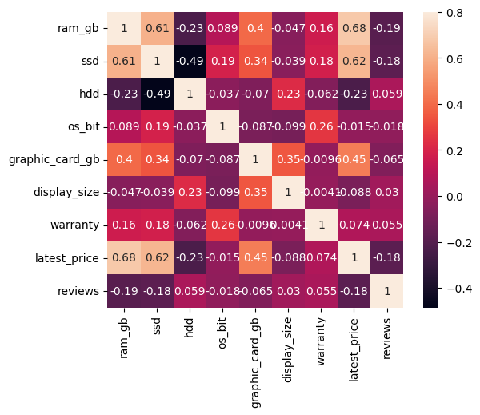
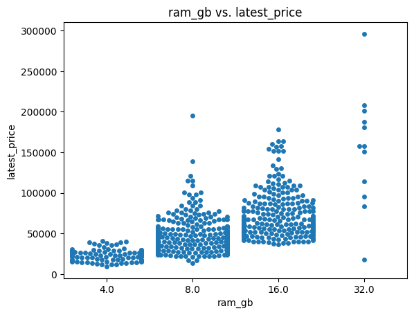

# Eohan's Portfolio

## Project 1: [Data Analysis and Machine Learning on the game Teamfight Tactics](https://github.com/rndmagtanong/ph_tft)
- Built an ETL Pipeline to collect data from the Riot Developer API
- Cleaned data in preparation for analysis and use for machine learning
- Analyzed win rates, frequency, and correlations between features
- Trained a RandomForestClassifier model to predict whether a composition would win or not
- Used GridSearchCV to choose the best parameters

## Project 2: [Laptop Visualization](https://github.com/rndmagtanong/laptop_vis)
- Used domain knowledge to make first impressions of the dataset
- Preprocessed and cleaned dataset for easier analysis
- Analyzed correlation of features to draw conclusions on pricing
- Used histograms, box plots, and swarm plots to visualize the data

## Project 3: [Income Predictor via Regression](https://github.com/rndmagtanong/filipino_income)
- Performed feature engineering to choose features most likely correlated to income
- Used DecisionTreeRegressor and RandomForestRegressor to predict income via chosen features
- Used a bit of hyperparameter tuning to get the best leaf node size
